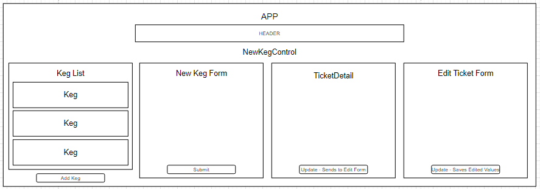

# <h1 align = "center"> Tap Room

## <h3 align = "center"> Intro To React

## <h2 align = "center"> About

 This is an application for a tap room. The user can view a list of the kegs available in the tap room, add new kegs, and track the amount avaiable in each keg as pints are sold. One page React app.

## **✅REQUIREMENTS**
* Install [Git v2.62.2+](https://git-scm.com/downloads/)
* Install [Node JS](https://nodejs.org/en/)
* Install [Visual Studio Code](https://code.visualstudio.com/)

## **💻SETUP**
* to clone this content, copy the url provided by the green 'Code' button in GitHub
* in command line use the command **git clone (GitHub url)**
* open the program in a code editor
* navigate to the tap-room directory and type **npm install** in the command line to compile the code
* type **npm start** in the command line to run the program in the browser

## 🔍Component Diagram

## 🐛Known Bugs

_No known bugs_

## 📫Support and contact details

Contact : Megan Hepner

## 🔧Technologies Used

* WebPack
* JavaScript
* React

## **📘 License**
